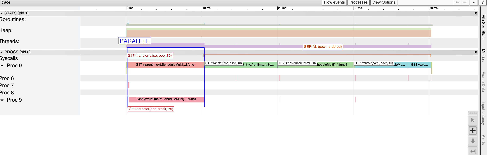

#example

## Behaviour-Oriented Concurrency (BOC)

Bank account transfers — the canonical example from Cheeseman et al.,
["When Concurrency Matters: Behaviour-Oriented Concurrency"](https://marioskogias.github.io/docs/boc.pdf),
OOPSLA 2023.

Five concurrent transfer requests. Some share accounts (serialized), others don't (parallel).
No locks, no `synchronized`, no `async/await`. The runtime enforces the right ordering automatically.

```js
Account: {
    balance Int
}

// In order to run, transfer must acquire src and dst atomically.
// If two transfers share an account, they serialize. If they don't, they run in parallel.
transfer #(src Account, dst Account, amount Int) {
    src.balance >= amount ? {
        src.balance = src.balance - amount
        dst.balance = dst.balance + amount
    }, {
        print("insufficient funds: need ${amount}, have ${src.balance}")
    }
}

main: {
    alice: Account(100)
    bob:   Account(0)
    carol: Account(50)
    dave:  Account(0)
    erin:  Account(200)
    frank: Account(0)

    transfer(alice, bob,   30)   // needs alice + bob
    transfer(bob,   alice, 10)   // needs bob  + alice  → serialized after above
    transfer(bob,   carol, 20)   // needs bob  + carol  → serialized after above
    transfer(carol, dave,  40)   // needs carol + dave  → serialized after above
    transfer(erin,  frank, 75)   // needs erin + frank  → independent: runs in parallel

    print("alice: ${alice.balance}")
    print("bob:   ${bob.balance}")
    print("carol: ${carol.balance}")
    print("dave:  ${dave.balance}")
    print("erin:  ${erin.balance}")
    print("frank: ${frank.balance}")
}
```

### Output

```
alice: 60
bob:   0
carol: 30
dave:  40
erin:  125
frank: 75
```

### How it works

Each `Account` is a **cown** (concurrent owner). A boc that needs multiple accounts
acquires all of them atomically before it can run. Two bocs that share a cown must
serialize; bocs with disjoint cowns may run in parallel.

| Transfer | Needs | Blocked by | Runs |
|---|---|---|---|
| `transfer(alice, bob, 30)` | alice, bob | — | immediately |
| `transfer(erin, frank, 75)` | erin, frank | — | immediately, **in parallel** |
| `transfer(bob, alice, 10)` | bob, alice | transfer 1 | after transfer 1 releases alice+bob |
| `transfer(bob, carol, 20)` | bob, carol | transfer 2 | after transfer 2 releases bob |
| `transfer(carol, dave, 40)` | carol, dave | transfer 3 | after transfer 3 releases carol |

### Goroutine trace

The parallelism and serialization are directly visible in `go tool trace`:



**Parallel (0–10 ms)**
- **G17** (Proc 0, pink): `transfer(alice, bob, 30)` — acquires alice + bob, runs body
- **G22** (Proc 9, pink): `transfer(erin, frank, 75)` — acquires erin + frank, runs body

These two fire at the same time because their cown sets are disjoint.

**Serial (10–40 ms, Proc 0 only)**
- **G11** (~10–20 ms): `transfer(bob, alice, 10)` — alice + bob now free; executes next
- **G12** (~20–30 ms): `transfer(bob, carol, 20)` — bob free; executes next
- **G13** (~30–40 ms): `transfer(carol, dave, 40)` — carol free; executes last

The three serial transfers queue behind each other because they share at least one account
with their predecessor. No explicit locking is written — the BOC runtime enforces it.

### Alternative syntax: Transfer as a struct

The same semantics are available with a named struct type. Each instance holds its
own cown, so two concurrent `Transfer.run()` calls on different instances still
serialize correctly through the account cowns.

```js
Transfer: {
    src Account
    dst Account
    amount Int
    run: {
        src.balance >= amount ? {
            src.balance = src.balance - amount
            dst.balance = dst.balance + amount
        }, {
            print("insufficient funds: need ${amount}, have ${src.balance}")
        }
    }
}

// Usage:
Transfer(alice, bob, 30).run()
Transfer(erin, frank, 75).run()
```

The cown acquisition covers `self.src` and `self.dst` — the same guarantee as the
boc-with-sig version, but expressed as an object.

## See Also 
- Yz Concurrency  -  [Concurrency](Concurrency.md)
