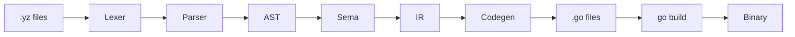

#impl 
# Yz Compiler — Implementation Plan

All pre-implementation decisions resolved in [decisions.md](file:///Users/oscar/code/github/oscarryz/yz-docs-1/Implementation/decisions.md).

---

## Architecture

```
Source (.yz) → Lexer → Parser → AST → Sema → IR → Codegen → Go Source → go build → Binary
```



## Project Structure

The compiler lives inside the existing `yz-docs-1` repository under the `compiler/` directory.

```
yz-docs-1/                    (existing repo)
├── README.md
├── spec/
├── Examples/
├── ...
└── compiler/                 ← NEW: all compiler code here
    ├── cmd/yzc/              CLI entry point
    │   └── main.go
    ├── internal/
    │   ├── lexer/            Tokenizer + ASI
    │   ├── token/            Token types
    │   ├── ast/              AST node definitions
    │   ├── parser/           Recursive descent parser
    │   ├── sema/             Semantic analysis (types, scopes)
    │   ├── ir/               Intermediate representation
    │   ├── codegen/          Go source code emitter
    │   └── build/            go build orchestration
    ├── runtime/rt/           Runtime library (imported by generated Go as `yz/runtime/rt`)
    │   ├── cown.go           Cown, Schedule, ScheduleMulti, ScheduleAsSuccessor (BOC scheduler)
    │   ├── thunk.go          Thunk[T], Go[T], GoStore[T] (used internally for struct-type boc results)
    │   ├── types.go          Built-in types (Int, Decimal, String, Bool, Unit) — plain Go structs
    │   ├── collections.go    Array[T], Dict[K,V], Range
    │   ├── core.go           Print, Info, BocGroup (structured concurrency)
    │   ├── http.go           http singleton (http.get, http.post)
    │   └── time.go           time utilities (time.sleep)
    ├── test/                 Conformance & integration tests
    ├── examples/             Example .yz programs
    ├── go.mod                module yz
    ├── Makefile
    └── README.md
```

---

## Phase Details

### Phase 0 — Project Setup ✅

| Item | Details |
|------|---------|
| Location | `compiler/` directory in this repository |
| Go module | `module yz` (local-only, not go-getable) |
| CLI | `cmd/yzc/main.go` with `build`, `run`, `new` subcommands |
| Makefile | `build`, `test`, `clean` targets |

> [!IMPORTANT]
> Internal imports use the `yz/internal/...` path (e.g. `import "yz/internal/lexer"`).
> The runtime package is imported by generated code as `yz/runtime/rt`.

---

### Phase 1 — Lexer ✅

#### `internal/token/token.go`
Token enum and `Token` struct (`Type`, `Literal`, `Line`, `Col`).

Token categories:
- Identifiers: `IDENT` (lowercase), `TYPE_IDENT` (uppercase multi-char), `GENERIC_IDENT` (single uppercase)
- Keywords: `BREAK`, `CONTINUE`, `RETURN`, `MATCH`
- Literals: `INT_LIT`, `DECIMAL_LIT`, `STRING_LIT`
- Non-word: `NON_WORD` (open char set)
- Delimiters: `LBRACE`, `RBRACE`, `LPAREN`, `RPAREN`, `LBRACKET`, `RBRACKET`, `COLON`, `ASSIGN`, `COMMA`, `SEMICOLON`, `DOT`, `HASH`, `FAT_ARROW`

#### `internal/lexer/lexer.go`
- UTF-8 rune scanning
- Multi-line strings (both `'...'` and `"..."`)
- String interpolation: `${expr}` inside strings; backtick is reserved for infostrings only
- Escape sequences: `\n \t \r \\ \' \" \` \0`
- Comments: `//` to EOL, `/* ... */` nested
- ASI: insert `SEMICOLON` after newline when prev token is identifier, literal, `break`/`continue`/`return`, `)`, `]`, `}`

---

### Phase 2 — Parser ✅

#### `internal/ast/ast.go`
Node types for all constructs. Key nodes:

| Category | Nodes |
|----------|-------|
| Statements | `ShortDecl`, `TypedDecl`, `Assignment`, `ReturnStmt`, `BreakStmt`, `ContinueStmt`, `BocWithSig` |
| Expressions | `BinaryExpr` (non-word L-to-R), `UnaryExpr`, `CallExpr`, `MemberExpr`, `IndexExpr`, `Ident`, `IntLit`, `DecimalLit`, `StringLit`, `BocLiteral`, `ArrayLiteral`, `DictLiteral`, `MatchExpr`, `GroupExpr`, `InfoString` |
| Types | `BocTypeExpr`, `ArrayTypeExpr`, `DictTypeExpr`, `SimpleTypeExpr` |
| Top-level | `SourceFile`, `VariantDef`, `BocParam` |

#### `internal/parser/parser.go`
Recursive descent. Key grammar points:
- **Expression**: `UnaryExpr { NON_WORD UnaryExpr }` — flat, left-to-right
- **Multiple assignment**: `IdentifierList "=" ExpressionList` — only lowercase `IDENT` on LHS
- **Boc literal**: `"{" { BocElement sep } "}"` — sep is `;` (ASI) or `,`
- **Boc declaration** (`BocWithSig` AST node): `name #(params) { body }` — params available in body without redeclaration (sema concern). `name #(params) = { body }` (boc expanded form) — body must redeclare params.
- **Match**: two forms (with/without subject expression)
- **Commas as separators**: commas act as statement separators in boc bodies alongside semicolons (supports `T, E,` generic params and match arm lists)
- **`=>` non-word rule**: standalone `=>` is always FAT_ARROW; `!=>`, `<=>` etc. are single NON_WORD tokens

---

### Phase 3 — Semantic Analysis

#### [NEW] `internal/sema/`
- **Scope**: linked list of scope frames, lexical lookup with shadowing
- **Type checker**: structural compatibility, width subtyping
- **Inference**: variable types from RHS, return types from last expression, generic params from usage
- **Boc declaration param scoping**: when the `name #(params) { body }` form is used (no `=`), sema adds the signature params into the body's scope so they are available without redeclaration
- **Variants**: track discriminant tags per variant constructor
- **Access**: `#()` hides everything not in the signature
- **FQN resolution**: resolve each boc's fully-qualified name from source path + nesting; detect collisions across source roots

---

### Phase 4 — IR

#### [NEW] `internal/ir/`
Bridge between AST and Go codegen. Maps Yz concepts to Go-friendly constructs:

| Yz Concept | IR Representation |
|-----------|-------------------|
| Lowercase boc (singleton) | Go struct embedding `std.Cown` + `Call()`/method bodies wrapped in `std.Schedule` |
| Uppercase boc (struct type) | Go struct embedding `std.Cown` + constructor func; fresh instance per call site for multi-cown bocs |
| Boc with methods | Go struct with methods; method body acquires cown(s) via `ScheduleMulti` when fields are other bocs |
| Non-word method `a + b` | Method call using symbol name: `a.Plus(b)`. `?` → `Qm`, `==` → `Eqeq`, `!=` → `Neq`, `&&` → `Ampamp`, `\|\|` → `Pipepipe`, `<=` → `Lteq`, etc. |
| Boc invocation (scalar result) | `std.GoStore[T]` into a declared variable; `BocGroup.Wait()` before use |
| Boc invocation (Unit result) | `BocGroup.GoWait(*Thunk[Unit])`; `BocGroup.Wait()` at scope end |
| Boc invocation (struct result) | `std.GoStore[T]` into declared variable; `BocGroup.Wait()` before use |
| Structured concurrency | `std.BocGroup` per scope; `GoWait`/`GoStore` register children; `Wait()` at scope end |
| `match` variant | Go `switch` on discriminant tag |
| `match` condition | Go `if/else` chain (stmt) or IIFE (expr) |
| Literal `1`, `"x"` | Boxed: `std.NewInt(1)`, `std.NewString("x")` — boxing done in codegen |
| Closure captures | Go closure; anonymous boc literals in HOF call args become sync Go closures |

---

### Phase 5 — Code Generation

#### [NEW] `internal/codegen/`
Emit `.go` files:
- One Go package per Yz namespace (directory)
- Generated `main.go` for the `main` boc (entry point); `func main()` shim calls `Main.Call().Force()`
- All boc structs embed `std.Cown`; method bodies use `std.Schedule` / `std.ScheduleMulti`
- Struct definitions for types; all fields typed as `std.*` (e.g. `std.Int`, `std.String`)
- Method definitions with non-word names mapped to symbol names (`Plus`, `Qm`, `Eqeq`, etc.)
- Structured concurrency via `std.BocGroup`; `GoWait`/`GoStore` per invocation; `Wait()` at scope end
- Literal boxing at call sites: `1` → `std.NewInt(1)`
- `go.mod` with dependency on `yz/runtime/rt`

#### [NEW] `internal/build/`
- Write generated `.go` files to `target/gen/` inside the project being compiled
- Run `go mod init` + `go mod tidy`
- Run `go build -o target/bin/app`
- `target/` should be added to `.gitignore` in `yzc new`-generated projects

---

### Phase 6 — Runtime Library

#### [NEW] `runtime/rt/`
Go package imported by generated code:

| File | Contents |
|------|----------|
| `cown.go` | `Cown` (lock-free queue scheduler); `Schedule[T]`, `ScheduleMulti[T]`, `ScheduleAsSuccessor[T]`; `BocGroup` with `GoWait` / `GoStore[T]` |
| `thunk.go` | `Thunk[T]`, `Go[T]` (goroutine spawn); used internally for boc results before `BocGroup.Wait()` resolves them |
| `types.go` | `Int`, `Decimal`, `String`, `Bool`, `Unit` — plain Go structs; symbol-named methods (`Plus`, `Minus`, `Qm`, `Eqeq`, etc.) |
| `collections.go` | `Array[T]`, `Dict[K,V]`, `Range`; HOF: `Filter`, `Each`, `ArrayMap` |
| `core.go` | `Print()`, `Info()` |
| `http.go` | `Http` singleton — `Get(url)`, `Post(url, body)` |
| `time.go` | `Time` singleton — `Sleep(ms)` |

---

### Phase 7 — Integration & Testing

- **Conformance tests**: Created **incrementally** as each phase lands (not upfront). `.yz` + `.expected` pairs in `compiler/test/conformance/`. Run via `go test`.
- **Golden tests**: `.yz` → expected `.go` output comparison
- **End-to-end**: compile + run + compare stdout to `.expected`
- **Error tests**: verify compile errors for invalid programs
- **CLI**: `yzc build`, `yzc run`, `yzc new <name>`
- **Project config**: minimal `project.yz` format

---

## Build Order — COMPLETE

All phases complete. 51 golden conformance tests passing. `go test -race ./...` passes.

1. Phase 0 — skeleton ✅
2. Phase 1 — lexer ✅
3. Phase 2 — parser ✅
4. Phase 6 (partial) — runtime types ✅
5. Phase 4 + 5 — IR + codegen ✅
6. Phase 3 — sema ✅
7. Iterate 4–6 — features one by one ✅
8. Phase 7 — conformance tests ✅

First milestone reached: `examples/milestone/` — concurrent HTTP fetches + counter boc.

## Verification Plan

### Automated Tests

All tests run from the `compiler/` directory:

```bash
cd /Users/oscar/code/github/oscarryz/yz-docs-1/compiler
go test ./...
```

Each phase adds tests in its own package (e.g. `internal/lexer/lexer_test.go`, `internal/parser/parser_test.go`).

### Manual Verification

After Phase 5, compile and run a concurrent `.yz` program end-to-end. The first milestone
program fetches two resources concurrently and implements a counter boc:

```bash
cd /Users/oscar/code/github/oscarryz/yz-docs-1/compiler
go run ./cmd/yzc run examples/milestone
```

Generated output goes to `target/gen/` inside the compiled project directory.
Binary is built to `target/bin/app`.
